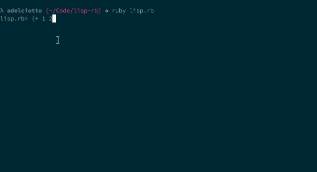

# lisp-rb

A short and incomplete Lisp repl written in the ruby programming
language. Only a small custom subset of a typical Lisp has been implemented.
This is simply a learning experience for myself, to gain more insight into both
the lisp and ruby programming languages.

It has the following features

* Lamba expressions via `lambda` or `=>`
* If statements.
* Variable definition via `def`.
* Basic error handling.
* Scoped variables.

Thanks to Peter Norvig's work on [lispy](http://norvig.com/lispy.html).
