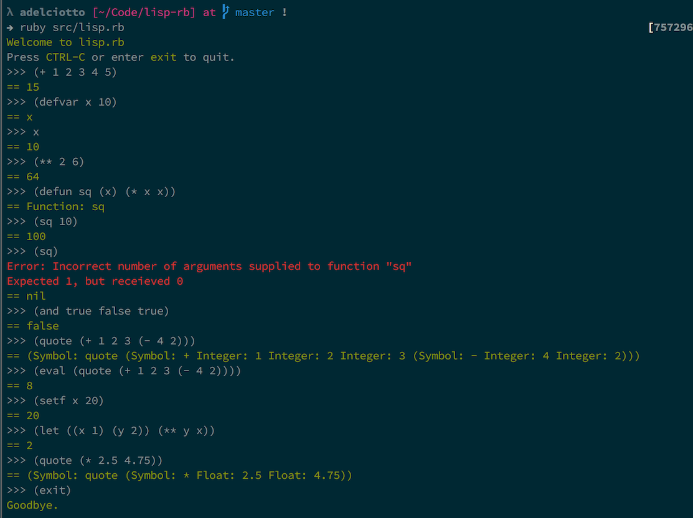

# lisp-rb

A Lisp interpreter written in the ruby programming language.
Only a small custom subset of a typical Lisp has been implemented.
This is simply a learning experience for myself to gain more insight into both
the lisp and ruby programming languages.

It has the following features so far.

* `if-else` statements.
* Variable and function definition via `defvar` and `defun`.
* Variable and function mutation by `setf`.
* Lamba expressions via `lambda`.
* `let` and `flet` statements for lexical scoping.
* `quote` and `eval` statements.
* Basic error handling.
* Scoped variables.
